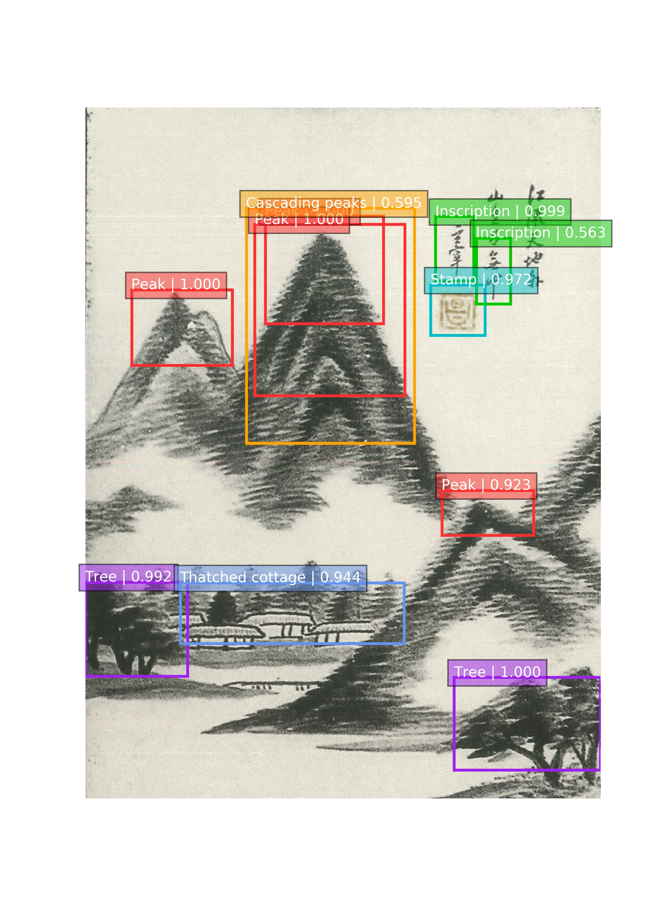
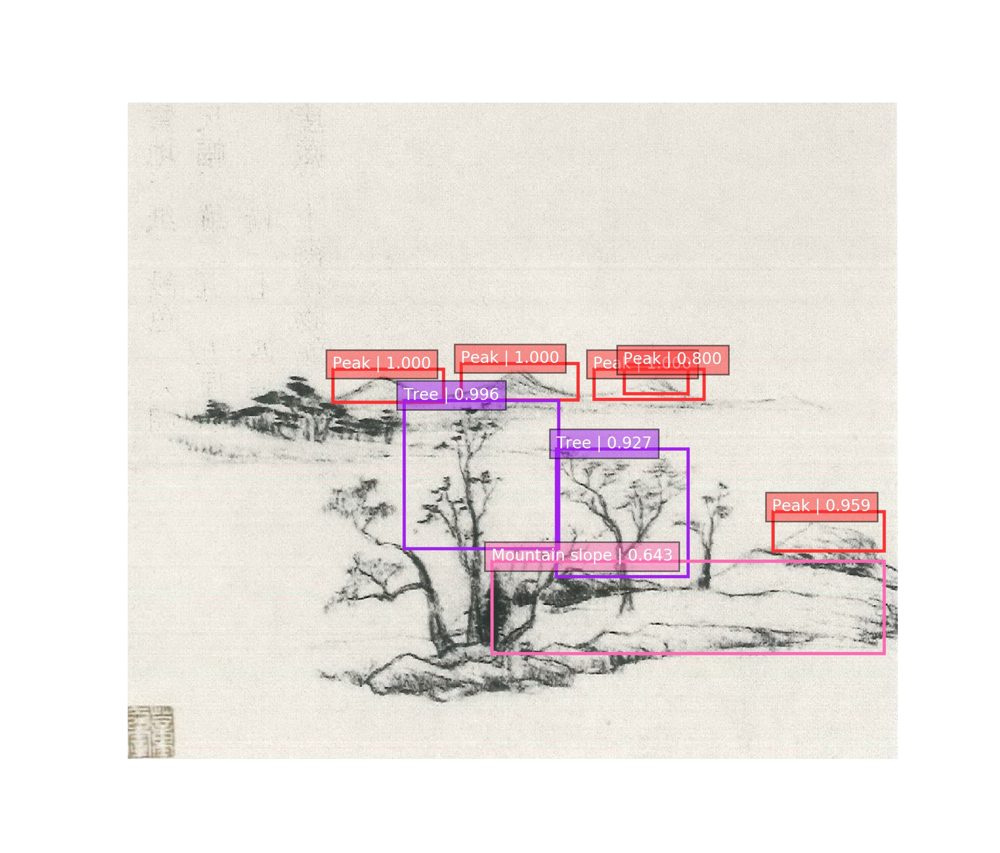
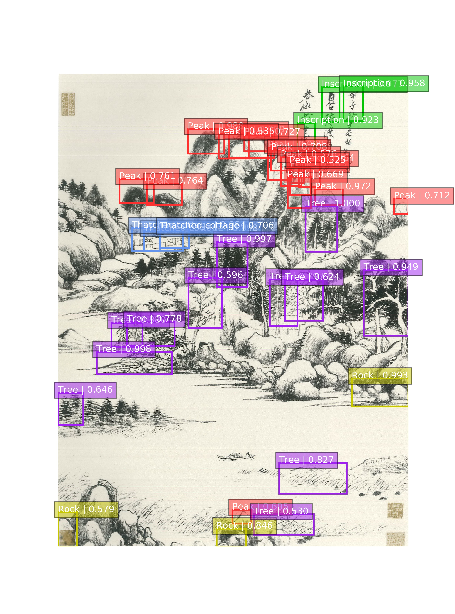

# Sequences-of-Objects

Sequences of Objects (SO) is a novel and effective method for ancient Chinese 'Shan Shui' painting composition classification.

This repository contains a TensorFlow implementation of SO. The repository is separated in two main parts: (1) object detector; (2) sequence classifier. Here we apply [SSD](http://arxiv.org/abs/1512.02325) as our object detector, and LSTM as our sequence classifier.

## Requirements:
* Tensorflow (>= 1.4)
* numpy
* six
* opencv-python
* matplotlib
* pillow

If you are using pip you can install these with

```bash
pip install tensorflow numpy six opencv-python matplotlib pillow
```

## Minimal example of object detector

The [object_detection.py](object_detector/notebooks/object_detection.py) contains a minimal example of object detection pipeline.

To run:
```bash
cd object_detector/checkpoints # at root of the repository
unzip checkpoints.zip
cd object_detector/notebooks # at root of the repository
python object_detection.py [painting_path]
```

Here are three examples of successful detection outputs:

Lofty and remote:
```bash
python object_detection.py '../demo/lofty_and_remote.jpg'
```



Wide and remote:
```bash
python object_detection.py '../demo/wide_and_remote.jpg'
```



Deep and remote:
```bash
python object_detection.py '../demo/deep_and_remote.jpg'
```



## Minimal example of Sequences of Objects

The [object_detection_save_results.py](object_detector/notebooks/object_detection_save_results.py) and [composition_classification.py](sequence_classifier/composition_classification.py) contain a minimal example of our SO pipeline.

To run:
```bash
cd object_detector/checkpoints # at root of the repository
unzip checkpoints.zip
cd object_detector/notebooks # at root of the repository
python object_detection_save_results.py [painting_path] # object detection
cd sequence_classifier # at root of the repository
python composition_classification.py [painting_path] # composition classification
```

or you can directly use the shell script [sequences_of_objects](sequences_of_objects):
```bash
chmod +x ./sequences_of_objects
./sequences_of_objects [painting_path]
```

For example:
```bash
chmod +x ./sequences_of_objects
./sequences_of_objects '../demo/lofty_and_remote.jpg'
```

first you can see the object detection results, then the composition classification results.

